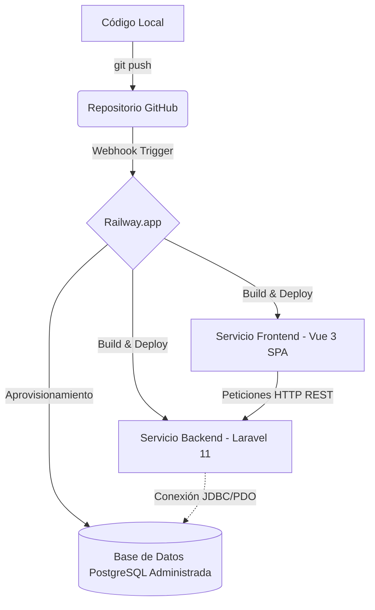

# 🏛️ Especificación de Arquitectura e Infraestructura Local

## 1. Entorno de Ejecución (Local / Nativo)
- **Base de Datos:** SQLite (`backend/database/database.sqlite`).
- **Backend API:** Laravel 11 ejecutado localmente (ej: `php artisan serve`) en puerto `8000` (`http://localhost:8000/api`).
- **Frontend SPA:** Vue 3 + Vite + Tailwind CSS ejecutado localmente (ej: `npm run dev`) en puerto `5174` (`http://localhost:5174`).

## 2. Diagrama de Relación de Datos (ERD)
- **`users`**: `id`, `name`, `email`, `password`, `created_at`, `updated_at`.
- **`pokemon_collections`**: 
  - `id` (PK)
  - `user_id` (FK -> users.id)
  - `pokemon_id` (Integer - ID oficial de PokéAPI)
  - `pokemon_name` (String)
  - `pokemon_type` (String)
  - `custom_notes` (Text, Nullable)
  - `created_at`, `updated_at`

## 3. Variables de Entorno Requeridas (`.env.example`)
```env
# Backend / Database
DB_CONNECTION=sqlite

# Integración PokéAPI
POKEAPI_BASE_URL=https://pokeapi.co/api/v2

# Bonus de IA (OpenAI API & Gemini API)
# Se utiliza tanto para el análisis de imágenes (GPT-4o-mini con Visión) como para la moderación de textos (Moderation API o GPT-4o-mini).
OPENAI_API_KEY=tu_api_key_aqui
GEMINI_API_KEY=tu_api_key_de_gemini_aqui
```

## 3.1. Flujo de Moderación de Textos y Contingencia (Fallback)
Cuando un usuario envíe texto para guardar en la base de datos (e.g. notas de favoritos) o al interactuar con el chat:
1. El backend (Laravel 11) interceptará la petición antes de persistirla o procesarla.
2. Realizará una llamada a la API de OpenAI (`POST https://api.openai.com/v1/moderations` para moderación, o `/chat/completions` para insights).
3. **Mecanismo de Fallback:** Si la API de OpenAI responde con error de cuota excedida (e.g. 429 `insufficient_quota`), fallo de red o error de servidor, el backend atrapará la excepción e intentará inmediatamente la misma operación usando la API de Google Gemini (utilizando la clave `GEMINI_API_KEY`).
4. **Identidad Neutral y Mensajes Genéricos:** Toda respuesta devuelta por el backend al cliente (frontend) debe ser neutral. No debe mencionar si el servicio fue proveído por OpenAI o por Gemini (ej: en lugar de *"Error de OpenAI"*, devolver *"El servicio de revisión de textos no está disponible"* o *"La nota contiene lenguaje inapropiado"*).
5. Si no pasa la moderación por cualquiera de los dos proveedores de IA, el backend detendrá el flujo y responderá con una estructura de validación HTTP 422 standard.
6. Si el texto es aprobado por el motor activo, se procede con la operación (guardado en base de datos o llamada al chatbot).

---

## 4. Entorno de Producción e Infraestructura en la Nube (Railway)

El entorno de producción se desplegará utilizando **Railway** como plataforma de Platform-as-a-Service (PaaS). La base de datos será un clúster administrado de PostgreSQL aprovisionado por la misma plataforma.

### Diagrama del Flujo de Despliegue (CI/CD Pipeline)



### Variables de Entorno en Producción (Railway Mapping)

#### Servicio: `backend` (Laravel 11 API)
Estas variables se inyectan en Railway para vincular el servidor con la base de datos de producción y los servicios externos:

| Variable | Origen / Valor Recomendado | Descripción |
| :--- | :--- | :--- |
| `APP_ENV` | `production` | Modo de ejecución de Laravel |
| `APP_KEY` | `base64:SkJeV11x9g82ZsEV2N6FwTpFkxpE5s5nj5+aM0s3JsU=` | Clave de cifrado de la aplicación |
| `APP_DEBUG` | `false` | Desactiva el modo de depuración para seguridad |
| `DB_CONNECTION` | `pgsql` | Driver de conexión a base de datos |
| `DB_HOST` | `${{Postgres.PGHOST}}` | Dirección del contenedor Postgres administrado |
| `DB_PORT` | `${{Postgres.PGPORT}}` | Puerto de conexión a Postgres |
| `DB_DATABASE` | `${{Postgres.PGDATABASE}}` | Nombre de la base de datos de producción |
| `DB_USERNAME` | `${{Postgres.PGUSER}}` | Nombre de usuario de Postgres |
| `DB_PASSWORD` | `${{Postgres.PGPASSWORD}}` | Contraseña del usuario de Postgres |
| `POKEAPI_BASE_URL` | `https://pokeapi.co/api/v2` | URL base de la PokéAPI |
| `OPENAI_API_KEY` | *(Clave API real generada en la plataforma de OpenAI)* | Clave de API de OpenAI para visión e insights |
| `GEMINI_API_KEY` | *(Clave API real generada en la consola de Google AI Studio)* | Clave de API de Gemini como fallback de visión e insights |

#### Servicio: `frontend` (Vue 3 SPA)
Este servicio se compila de manera estática y requiere la URL pública del backend para comunicarse:

| Variable | Valor Recomendado | Descripción |
| :--- | :--- | :--- |
| `VITE_API_URL` | `https://<dominio-backend-generado>.up.railway.app/api/v1` | Endpoint público del backend en producción |
