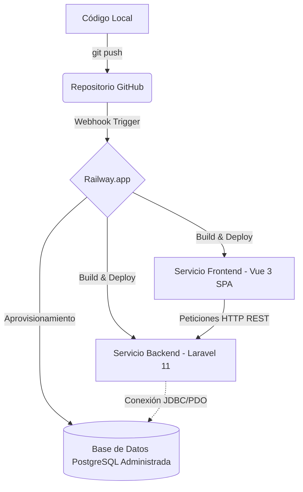

# 🏛️ Especificación de Arquitectura e Infraestructura Local

## 1. Entorno de Ejecución (Docker Compose)
- **Base de Datos:** PostgreSQL 15 en puerto `5432` (`pokedex_db`).
- **Backend API:** Laravel 11 corriendo bajo PHP 8.2 en puerto `8000` (`http://localhost:8000/api`).
- **Frontend SPA:** Vue 3 + Vite + Tailwind CSS en puerto `5173` (`http://localhost:5173`).

## 2. Diagrama de Relación de Datos (ERD)
- **`users`**: `id`, `name`, `email`, `password`, `created_at`, `updated_at`.
- **`pokemon_collections`**: 
  - `id` (PK)
  - `user_id` (FK -> users.id)
  - `pokemon_id` (Integer - ID oficial de PokéAPI)
  - `pokemon_name` (String)
  - `pokemon_type` (String)
  - `custom_notes` (Text, Nullable)
  - `created_at`, `updated_at`

## 3. Variables de Entorno Requeridas (`.env.example`)
```env
# Backend / Database
DB_CONNECTION=pgsql
DB_HOST=db
DB_PORT=5432
DB_DATABASE=pokedex_db
DB_USERNAME=postgres
DB_PASSWORD=secret

# Integración PokéAPI
POKEAPI_BASE_URL=[https://pokeapi.co/api/v2](https://pokeapi.co/api/v2)

# Bonus de IA (Gemini API)
GEMINI_API_KEY=tu_api_key_aqui
```

---

## 4. Entorno de Producción e Infraestructura en la Nube (Railway)

El entorno de producción se desplegará utilizando **Railway** como plataforma de Platform-as-a-Service (PaaS). La base de datos será un clúster administrado de PostgreSQL aprovisionado por la misma plataforma.

### Diagrama del Flujo de Despliegue (CI/CD Pipeline)



### Variables de Entorno en Producción (Railway Mapping)

#### Servicio: `backend` (Laravel 11 API)
Estas variables se inyectan en Railway para vincular el servidor con la base de datos de producción y los servicios externos:

| Variable | Origen / Valor Recomendado | Descripción |
| :--- | :--- | :--- |
| `APP_ENV` | `production` | Modo de ejecución de Laravel |
| `APP_KEY` | `base64:SkJeV11x9g82ZsEV2N6FwTpFkxpE5s5nj5+aM0s3JsU=` | Clave de cifrado de la aplicación |
| `APP_DEBUG` | `false` | Desactiva el modo de depuración para seguridad |
| `DB_CONNECTION` | `pgsql` | Driver de conexión a base de datos |
| `DB_HOST` | `${{Postgres.PGHOST}}` | Dirección del contenedor Postgres administrado |
| `DB_PORT` | `${{Postgres.PGPORT}}` | Puerto de conexión a Postgres |
| `DB_DATABASE` | `${{Postgres.PGDATABASE}}` | Nombre de la base de datos de producción |
| `DB_USERNAME` | `${{Postgres.PGUSER}}` | Nombre de usuario de Postgres |
| `DB_PASSWORD` | `${{Postgres.PGPASSWORD}}` | Contraseña del usuario de Postgres |
| `POKEAPI_BASE_URL` | `https://pokeapi.co/api/v2` | URL base de la PokéAPI |
| `GEMINI_API_KEY` | *(Clave API real generada en Google AI Studio)* | Habilita el reconocimiento por visión e insights de la IA |

#### Servicio: `frontend` (Vue 3 SPA)
Este servicio se compila de manera estática y requiere la URL pública del backend para comunicarse:

| Variable | Valor Recomendado | Descripción |
| :--- | :--- | :--- |
| `VITE_API_URL` | `https://<dominio-backend-generado>.up.railway.app/api/v1` | Endpoint público del backend en producción |
